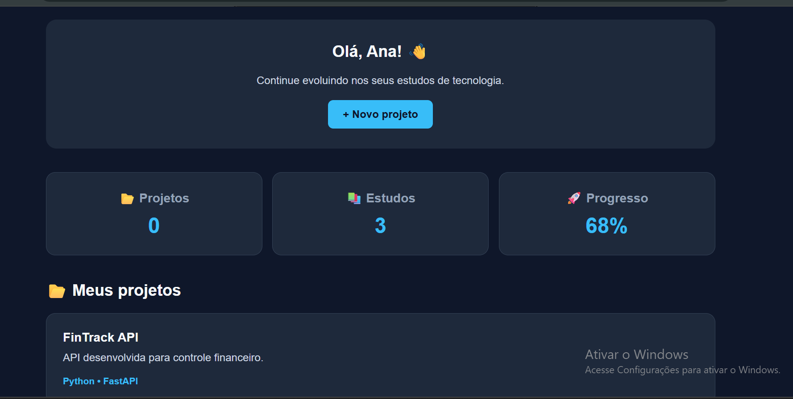

# 🚀 DevTrack

Sistema web desenvolvido para organizar projetos de programação e acompanhar a evolução dos estudos em tecnologia.

O DevTrack foi criado como um projeto de portfólio para praticar desenvolvimento web, JavaScript, manipulação do DOM, armazenamento local e Git/GitHub.

---

## 📸 Preview

Dashboard principal do DevTrack:



---

## ✨ Funcionalidades

- 📂 Cadastro de projetos
- ✏️ Edição de projetos
- 🗑️ Exclusão de projetos
- 💾 Persistência de dados com LocalStorage
- 📊 Dashboard com quantidade de projetos
- 📚 Acompanhamento de estudos
- 🎨 Interface responsiva e moderna

---

## 🛠️ Tecnologias utilizadas

- HTML5
- CSS3
- JavaScript
- LocalStorage
- Git
- GitHub
- VS Code

---

## 📁 Estrutura do projeto

```text
DevTrack/
│
├── index.html
├── style.css
├── script.js
├── README.md
└── preview.png